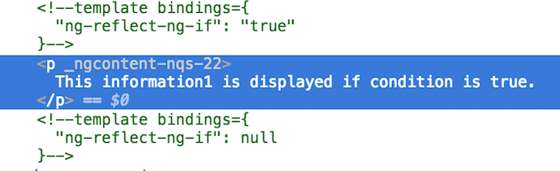

# Angular 指令

**Angular的设计核心理念是数据绑定、组件化.** 请时刻牢记这句话！

按照惯例，先来剧情透露：

- angular指令种类
- angular内置ngif指令
- `<template>`标签
- `*ngIf`语法糖
- 学习自定义一个指令

### 1.angular指令种类
Angular的指令分为以下三种：
- 组件
- 属性指令
- 结构指令

① 组件
> Angular应用是由一个个的组件（component）构成的;组件是由html模板、组件类构成。
> html模板实现页面的展示内容，组件类用来控制视图的展示形式。每一个组件都以@Component装饰器函数开始，该函数接受一个元数据对象参数，
这个元素苏描述了html模板与组件类如何协同工作的。

②属性指令
> 属性指令用于改变元素的外观和行为。如内置的`ngClass`、`ngStyle`指令。

③结构指令

>结构指令通过添加或删除DOM元素来改变DOM布局。如内置的`ngIf`、`ngSwitch`、`ngFor`等指令。

***下面我们主要针对`ngIf`来谈一下angular的一部分优缺点。***

先看一个栗子：
```angular2html
<p *ngIf="true">
This information1 is displayed if condition is true.
</p>
<p *ngIf="!true">
Tihs information2 is deleted if condition is true.
</p>
```
打开浏览器及开发工具，效果如下;

