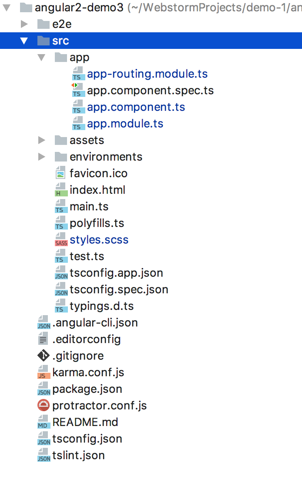
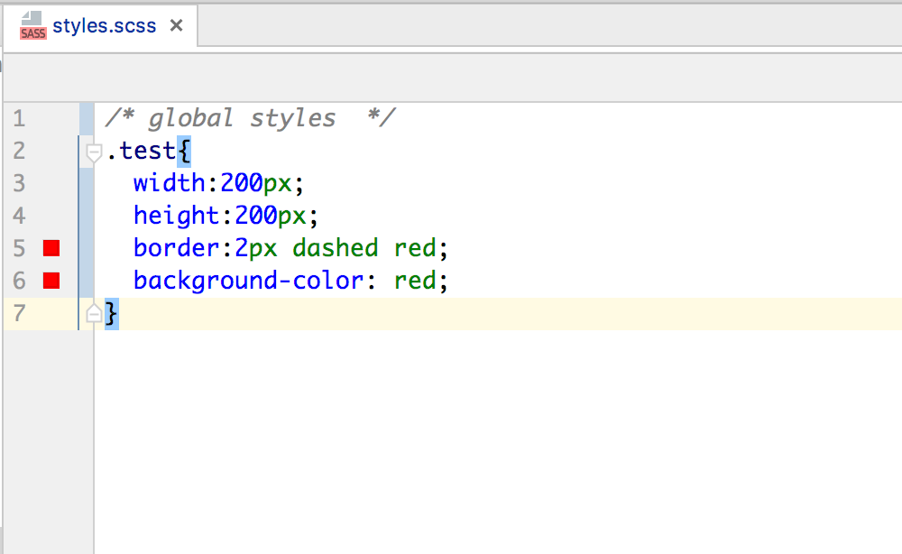
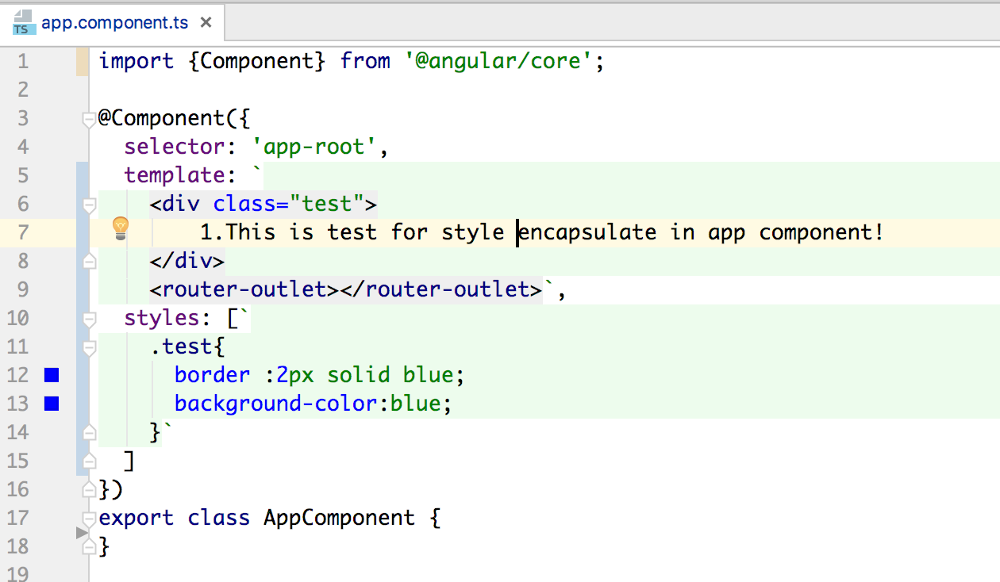
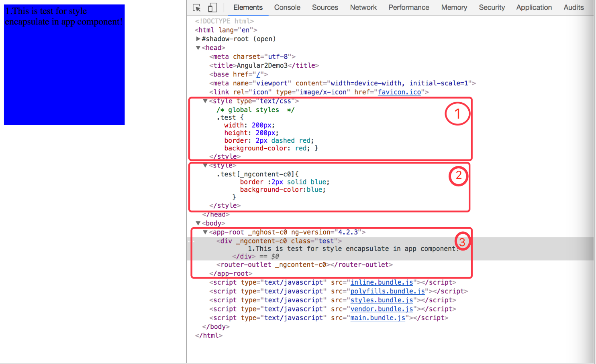
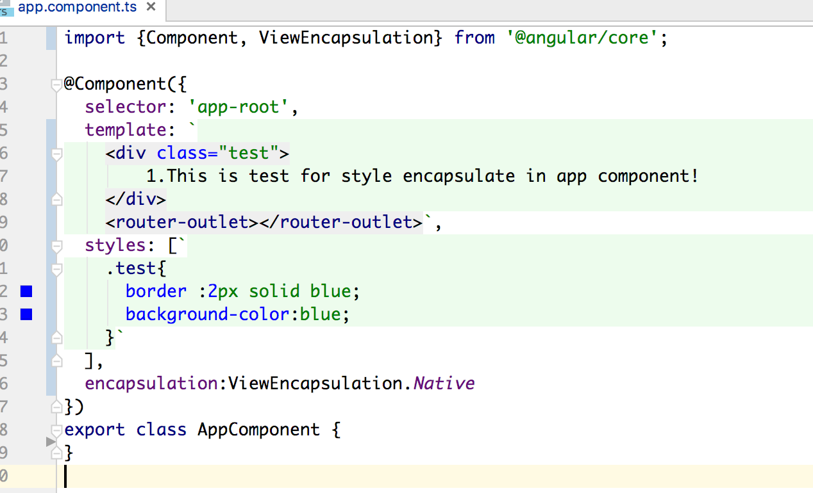
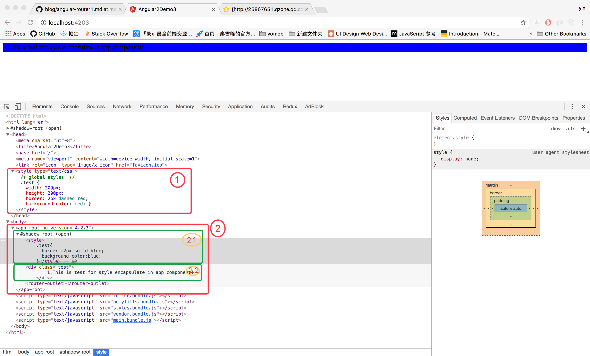
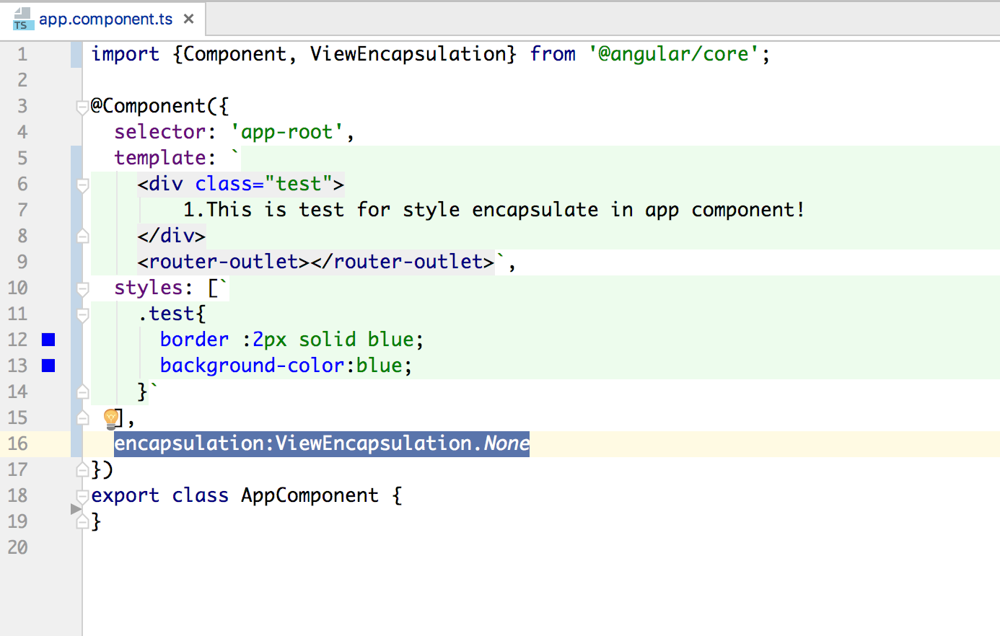
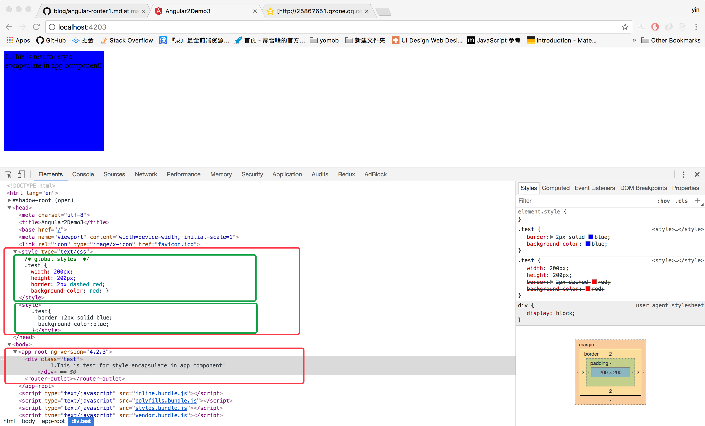

# Angular2 组件视图/样式封装机制

> 尽管css的意思是**层叠样式表**，但有时候我们并不需要"层叠"。既然angular采用了组件化的设计模式，那么
>我们能不能采用组件化的方式，为某个组件提供特定的局部（组件级别）个性样式而不影响到页面的其他部分，答案是肯定的。

### 1.标准html中样式的引入方式：
 1. 内嵌样式：直接在元素标签内设置css,如下栗子：
    `<div style="background-color:red">内联样式</div>`
 2. 标签样式：采用`style`标签元素设定，如下栗子：
 ```angular2html
  <style> 
    .nav-bar{font-size:14px;}
  </style>`
  ```
 3. 链接引入样式:
     `<link rel="stylesheet" type="text/css" href="style.css">`
 4. 导入样式:
     ```angular2html
     <style>
          @import url(../xx/style.css);
     </style>
    ```
 ### 2.angular中样式引用方式：
 1. 全局样式引入
    1. 配置文件设置：.angular.cli.json文件中设置:`"apps":{
           "styles": ["scss/style.scss"],
           "scripts":[...]
          }` 
    2. 入口文件引入：index.html文件中：`<link href="assets/css/font-awesome.min.css" rel="stylesheet">`
    3. 入口文件样式块：`<style>.nav-bar{font-size:12px;}</style>`
 2. 组件级别引入：
    1. 组件内联：`styles:".nav-bar{font-size:16px;}`
    2. 组件外联：`styleUrls:['./session.component.scss']`
 3. 标签级别样式：`<div style="font-color:red"></div>`
 
 ### 3. shadow DOM
 
 ##### 3.1：开发angular项目时，假如我们在配置文件.angular.cli.json、组件内联/外联、标签内，多处都设置了同样的样式，页面改如何展示？
 
  让我们先来预测一下结果：
  a.假如三处引入的样式都没有采用`!important`,那么根据优先级，页面的样式也就是标签内嵌样式的结果；
  b.假如三处引入的样式具有javascript模式的变量作用域概念，那么页面的样式应该是最小子组件覆盖父层组件样式；
  c.假如三处引入样式具有样式重写效果，那么，将按照样式的定义先后顺序，最后定义的样式覆盖先定义的样式；
  
 > 令人兴奋的是，上面三种我们预测的效果，angular都有实现的技术：你所需要做的仅仅是在组件定义时加上一条元数据：`encapsulation:ViewEncapsulation.Emulate/Native/None`
 > 而这些神奇的功能效果，背后所支撑的技术就是目前组件化前端框架的基础：**Shadow Dom**.
 
 ##### 3.2 Shadow DOM
 什么是shadow dom技术？
 简单来说，就是浏览器标准中开放给开发者用来自定义 html标签元素的API,接口也极其简单：`Element.createShadowRoot()`;
 
 Shadow DOM允许开发者在页面的DOM树结构里面，插入自定义的DOM元素子树，DOM元素子树的内容、页面样式、javascript均与宿主DOM树相互独立.
 
 ***没错，这就是当今2017年前端最流行的组件化设计思想，得以实现的技术基础！！！***
 刨根问底，请用力戳破==>
 [MDN文档](https://developer.mozilla.org/zh-CN/docs/Web/Web_Components/%E5%BD%B1%E5%AD%90_DOM)、
 [参考文章](https://aotu.io/notes/2016/06/24/Shadow-DOM/index.html)。
 
 ### 4. angular视图封装 
  ——————`encapsulation:ViewEncapsulation.Emulate/Native/Native`
 下面我们来依次看看angular是如何来实现这三个神奇的效果：
 
 - **Emulate**：这是angular2默认配置方式，即：shadow DOM仿真方式，默认将组件样式、内容封装在组件的上下文环境中；
 - **Native**: 即：原生Shadow DOM的配置方式，采用此种配置时，angular将完全采用MDN标准的Shadow DOM将子组件封装为子DOM树；
 - **None**  : 无Shadow DOM配置方式，采用此种配置时，angular2将完全不采用Shadow DOM技术，而是将子组件按照标准html方式渗透、暴露给页面其他元素；
 
 为此我们看一下才用三种不同配置时，浏览器开发者模式下页面html代码的差异：
 创建一个最简单的angular项目；并在引入的全局样式文件style.scss、及app组件内联样式中分别定义一个`.test`的样式类目录结构如下
 为了便于区分，我们在全局样式定义前加上一行注释`/* global styles  */`；
 
 
 
 
 
 ① 默认配置方式——`Emulate`，由于我们在app组件中并未定义`ecapsulation`meata元素，此时为默认配置方式，打开浏览器，我们可以看到页面结构如下:
 可以清楚的看到，我们在app组件中的页面元素div段落(红色方框3)，并且多出来一个`_ngcontent-c0`属性；
 同时在`head`标签里面可以看到有两个`style`样式标签；两个`style`样式标签内都是对.test样式类进行定义；
 所不同的是（方框1）为`.test`，方框2为`.test[_ngcontent-c0]`,细心的同学可能已经发现，
 > 1. 这两个样式类，分别对应我们之前设置的全局scss样式及app组件级别的样式；
 > 2. 页面的div元素尺寸采用了全局的样式，而在app组件内部样式中，我们并没有设置尺寸相关的样式；
      说明采用emulate配置方式，会继承全局的可继承的样式；  
 > 3. 页面div元素的背景色和边框色都采用了app组件内部定义的样式，我们在全局及app组件内部两处都定义了背景色、边框的样式；
      说明采用emulate配置方式，子组件会重写全局的样式；
   
    结合上面三点，我们就不难理解，这个`_ngcontent-c0`的属性正是angular2为了识别封装的组件，自动添加的，
 子组件可以继承并重写全局/父组件的演示，这就是angular的**仿真Shadow DOM技术**；*
 
 
 
 ② 原生配置方式——`Shadow DOM`,在app组件的装饰器内添加`encapsulation:ViewEncapsulate.Native`,再次运行项目，打开浏览器，如下：
   此时，a.页面的内容元素没有变，但相比较①没有了属性`_ngcontent-c0`，同时在外层多了一个`#shadow-root(open)`的标签，这个正是标准的Shadow DOM技术；
   b.全局样式的标签位置和内容都没有变化（图中红色方框①）；c.app组件级别的样式不仅位置、样式类选择器都发生了变化：1）位置由`head`头部转移到 `#shadow-root(opne)`标签内部；
   2）样式类没有添加`_ngcontent-c0`类似的angular框架属性；
   此种原声shadow dom的配置方式，就是我们在本文第3节中提到的*原生Shadow DOM*；
   > 1. 此处div元素采用浏览器默认的尺寸样式，没有采用全局的尺寸样式；说明，此处子组件已无安全与福组件/全局样式隔离，不受全局样式影响；
   > 2. 此处div元素背景色、边框均采用子组件app设置的样式，说明此时，子组件可自由定义局部样式属性；
   
   
   
 ③ 无Shadow DOM配置方————在app组件的装饰器内添加`encapsulation:ViewEncapsulate.None`,再次运行项目，打开浏览器，如下：
 
 此时页面元素的显示效果与仿真DOM方式的配置一模一样；html代码与仿真DOM配置方式下也极为相似；我们看一下与`emulate`配置方式的不同之处：
 > app子组件中配置的`.test`类样式没有angular2自动添加的组件识别属性`_ngcontent-c0`；
 
 
    
 
 
   
  
 