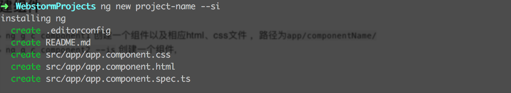
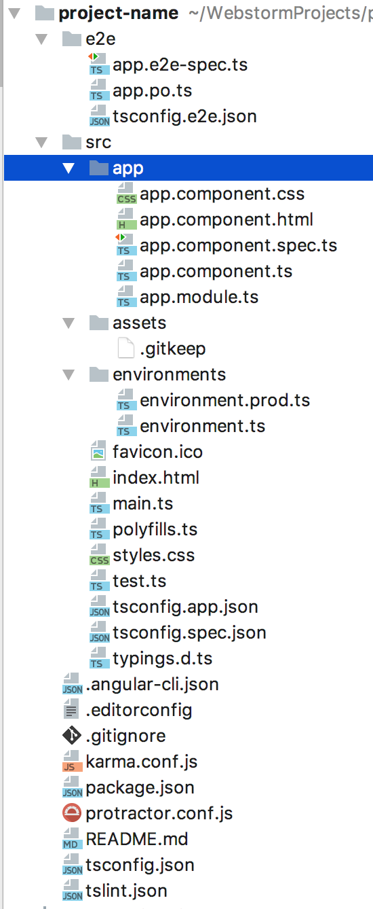
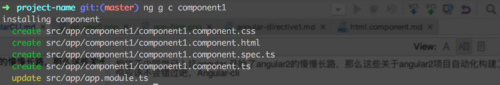
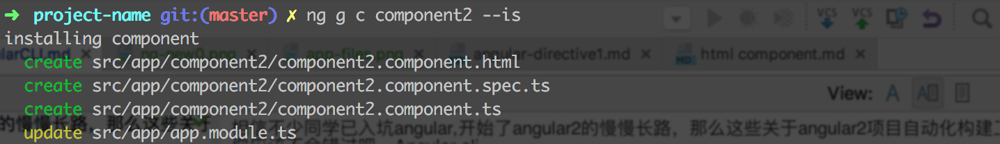
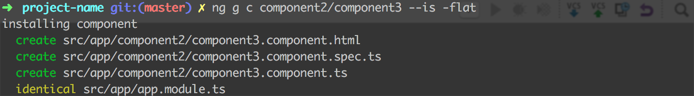
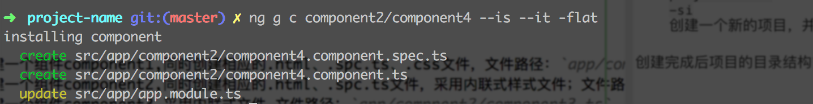
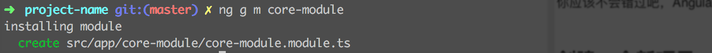
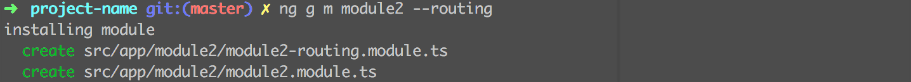
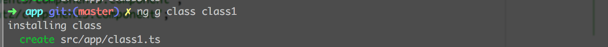
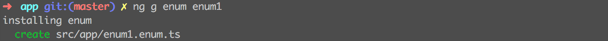

相信不少同学已入坑angular,开始了angular2的慢慢长路，那么这些关于angular2项目自动化构建工具，
你应该不会错过吧，Angular-cli

### 1.创建一个新项目
- `ng new project-name `      创建一个新的项目,并自动安装依赖包,项目名称为：**projec-name**
- `ng new project-name -si`   创建一个新的项目，并跳过node依赖包自动安装（`-si`即`--skip-install`）

创建完成后项目的目录结构如下：

### 2.创建组件

- `ng g c component1`                           创建一个组件component1,同时创建相应的.html、.spc.ts、.css文件，
- `ng g c component2 --is`                      创建一个组件component2,同时创建相应的.html、.spc.ts文件，采用内联式样式文件；
- `ng g c component2/component3 --is -flat`     创建一个组件component3,采用内联式样式;
- `ng g c component2/component4 --is --it -flat`创建一个组件component4,采用内联式样式、内联式模板;

如下图所示：

①`ng g c component1`

②`ng g c component2 --is`

③`ng g c component2/component3 --is -flat`  `-flat` 组件在当前文件夹下不新建目录

④`ng g c component2/component4 --is --it -flat`

### 3.创建模块

- `ng g m core-module`       创建一个模块，模块名称 **CoreModuleModule**;
- `ng g m module2 --routing` 创建一个模块，模块名称 **Module2Module**,*采用外联路由文件*;

如下图：

①`ng g m core-module` 

②`ng g m module2 --routing`       `--routing` 同时新建单独路由文件

###  4.创建类

- `ng g class class1`   创建一个类，类名**Class1**
- `ng g class class2 --spec`   创建一个类，类名**Class2**

如下图：

①`ng g class class1`

②`ng g class class2 --spec`  同时创建.spec.ts文件

### 5.创建可枚举类

- `ng g enum enum1` 创建一个可枚举类，类名**Enum1** 文件路径：`app/enum1.enum.ts`

如下图

①`ng g enum enum1`
