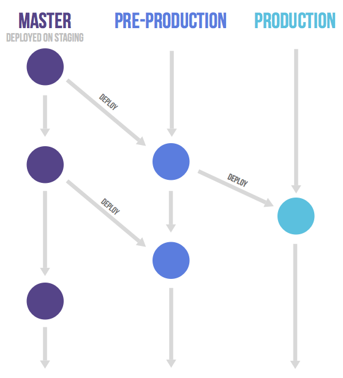

### 分布式 workflow--项目工作流程

&emsp;&emsp;在软件开发的过程中，项目团队必然会使用版本控制系统，比如CVS、SVN(集中式版本控制系统)、GIT(分布式版本控制系统)。
版本控制系统选定后，紧接着为了提高团队的协同开发效率，就需要选择一种适合当前团队、或者适合当前项目的开发流程。
这里以主流的git版本控制系统为例，介绍常见的3种工作流：**①Git flow ②Github flow ③Gitlab Flow**

&emsp;&emsp;本文的三种工作流程，都属于功能驱动式开发(Featrue-driven development,简称FDD)范畴，FDD即项目开发的起点是需求，维护master主分支，切分出功能分支(feature branch)、补丁分支(hotfix branch);
完成开发后，功能分支、补丁分支合并到主分支，同时被删除。

 - Git workflow

 > 优点：流程清晰，版本清晰,理解简单

 > 缺点：长期维护两个主分支，不便于持续发布；分支切换频繁

 > 使用场景：定期发布，长期维护，如：游戏开发项目、底层服务程序

 > 简介：维护2+3+个branch

 > 1. 长期维护2个分支master、develop分支 :

 >  `master branch  : 用于发布、生产部署，时刻保持最稳定生产版本，并标注版本号(Tag);`

 >  `develop branch : 用于日常开发维护，时刻存放最新开发版本，每次发开功能是从次分支拉出新的feature分支进行开发。`

 > 2. 开发、发布维护3个临时分支，功能开发、部署完成之后便被删除

 >  `release branch : 用于正是发布前预发布，进行文档及版本元信息更新。合并到master分支完成正是发布后，便将该分支合更新并到develop分支，删除该分支；`

 >  `hotfix branch  : 用于发布后紧急bug修复，或热修复，从master分支拉出。完成bug修复后便合并到master分支，同时将更新合并到develop分支，删除该分支；`

 >  `featureXXX branch : 用于新功能开发，当需要开发新功能时，从develop分支中拉出，用于开发新功能。开发完成后，便合并到develop分支并被删除；`

 > 3.Git workflow 具体工作流程图如下：

 

      
 

 - Github workflow

 > 优点：简单、适合频繁发布版本

 > 缺点：版本概念模糊

 > 使用场景：不定期持续发布、热发布，如：网站开发

 > 简介：github.com 使用的工作流程、git flow精简版

 > 1. 长期维护1个分支；

 >  `master branch   : 用于发布、功能更新，时刻保持最新版本、稳定版本、随时可发布；`

 > 2. 短期维护1+开发分支；

 >  `featureXX branch : 用于开发新功能；从master分支拉出。功能开发完成后，向master分支发送pull request请求(简称PR)，合并请求被master branch允许后，该分支被删除；`

 > 3. Github Flow工作流程示意图如下

    

 - Gitlab workflow

 > 优点：兼容Git Flow 和Github Flow 两种模式

 > 特点：**上游优先** —— 只有上游分支采纳的版本变化，才会应用到其他分之；

 > 简介： 持续发布模式 + 版本发布模式

 > 1. 持续发布模式

 >  `master branch         : 开发环境分支，用于开发功能使用，是其他所有分支的上游分支。该分支更新的代码会向下应用到其他环境分支；`

 >  `pre-production branch : 预发环境分支，用于预发布测试，从master分支拉出，同时是production分支的上游。`

 >  `production branch     : 生产环境分支，用于生产发布，从pre-production分支拉出，是pre-production分支的下游。`

 >  `featureX/fixX branch  : 开发功能/修复bug分支，用于开发/修复bug,从master分支拉出，是master分支的上游。该分支开发完成后，先合并到mster分支，确认没有问题后；再cherry-pick到pre-production分支；pre-production分支也确认没有问题再cherry-pick到production分支。`

 > 2. 版本发布模式

 >  `master branch : 开发环境分支，用于开发功能使用，是其他所有分支的上游分支。该分支更新的代码会向下应用到其他环境分支；`
 >  `Version-x branch : 发布版本分支，从master分支拉出，用于发布不同版本。`
 >  `featureX/fixX branch  : 开发功能/修复bug分支，用于开发/修复bug,从master分支拉出，是master分支的上游。该分支开发完成后，先合并到mster分支，确认没有问题后；再cherry-pick到相对应的version-x分支。`

 > 3. 两种工作模式的流程示意图

 

    
    
 

> 参考文章：

1. Git workflow 参考： [git flow cheatsheet](https://danielkummer.github.io/git-flow-cheatsheet/) 、[Git tower](https://www.git-tower.com/learn/git/ebook/en/desktop-gui/advanced-topics/git-flow)

2. Github workflow 参考：[github guide](https://guides.github.com/)

3. Gitlab workflow 参考：[gitlab flow](https://about.gitlab.com/2014/09/29/gitlab-flow/)、[gitlab workflow](https://about.gitlab.com/2016/10/25/gitlab-workflow-an-overview/)

4. 版本控制系统入门介绍,参考： [Subversion VS Git](https://www.liaoxuefeng.com/wiki/0013739516305929606dd18361248578c67b8067c8c017b000/001374027586935cf69c53637d8458c9aec27dd546a6cd6000)
