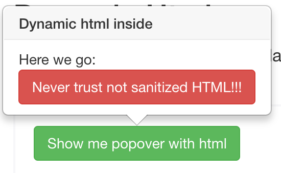
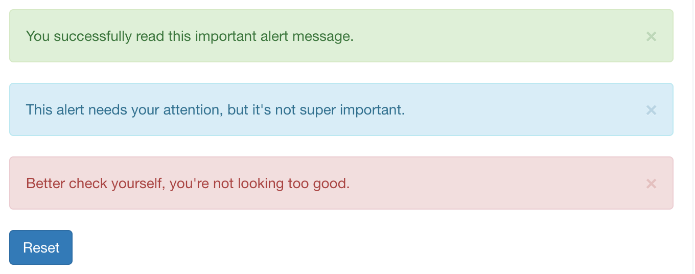
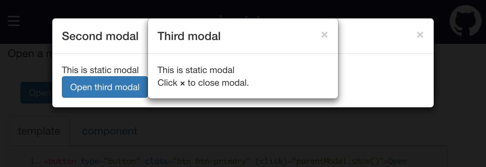
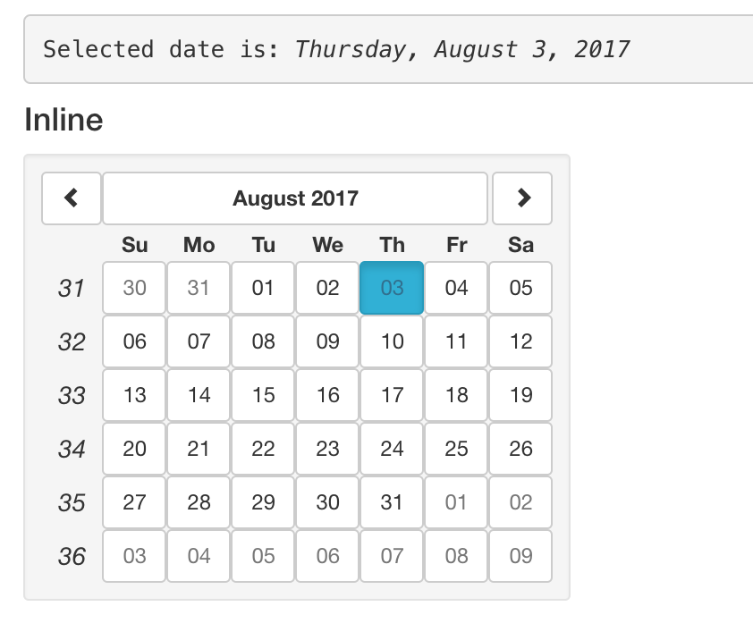
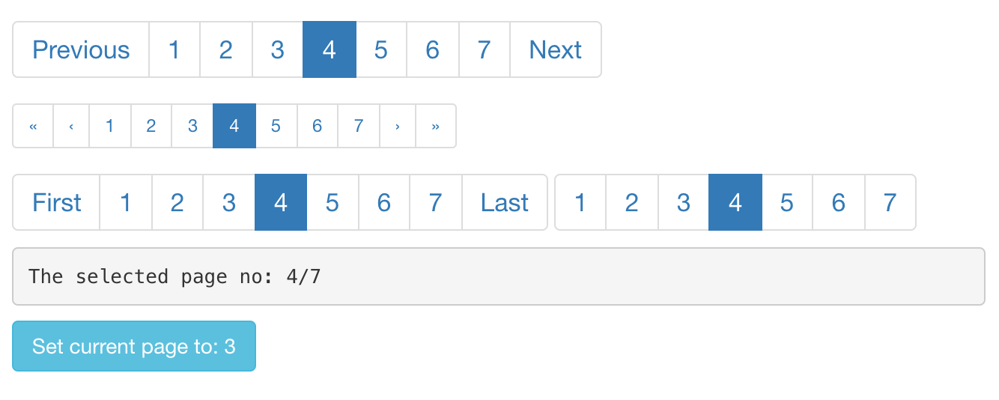

# Ngx-bootstrap组件总结

> 前端开发会有一些常见的需求，比如输入表单、日期、下拉菜单、表格、提示、弹窗等等，一般项目开发周期都被公司产品、市场等各种因素影响，被不断的压缩。除了极个别的开发大神，以及一些框架开发者，极少出现会自己去从零开始写这些常见的组件。

> 而通常做法是引入一个成熟的插件/库来实现；
**Ngx-bootstrap**便是可供选择的一个组件库，当然你也可以选择比如[Prime-NG](https://www.primefaces.org/)、[material](https://material.io/)、[material-ui](http://www.material-ui.com/)等其他各种优秀的风格组件库，来做为你开发的工具。

> 本篇仅以`ngx-bootstrap`为例，介绍前端开发过程中一些常用的组件。

包括并不限于以下17种：
- 提示：tips——用于简短的缩写或特殊名词，用悬浮窗方式进行解释、备注。
- 弹窗：popover——点击后显示的隐藏导航、链接或注释。
- 消息条/警告：alerts——操作消息提示、或者系统消息列表提示。
- 模态框：modal——弹窗层对话框，一般用于有序步骤操作。

- 时间选择：timepicker——时间选择器，可针对具体到秒的时间选择，比如定时发送邮件等。
- 日期选择：datepicker——日期选择器，用于日期的选择，时间选择范围为年、月、日，可定制最大最小日期等。

- 下拉菜单：dropdowns——点击按钮弹出隐藏下拉菜单、导航或说明，菜单悬浮。
- 折叠面板：accordion——点击目标显示出隐藏内容，隐藏内容从属于文档流，会重新绘制dom;
- 标签页：tabs——点击标题菜单，切换不同的页面，用于分页显示同一类主题；
- 导航条：navBar——页面顶部或者侧边导航栏，用于页面主题内容的跳转控制、页面布局；
- 轮播图：carousel——图片轮播，一般用于多幅宣传图册的自动循环播放；

- 按钮：button——定制页面按钮的样式风格；
- 输入表单：imput——定制化页面的输入表单样式风格，用户可自定义；
- 表格：sortable——可排序内容，用于列表数据的排序用
- 分页：pagination——表格数据的分页展示控件，用于在优化页面展示效果，提升用户体验；
- 进度条:progressBar——一般用于数据加载、用户操作进度指示作用，提升用户页面交互体验；

具体效果图如下
1. carousel

2.  tips

3. popover

4. alertts

5. modal

6. timepicker

7. datepicker

8. pagination

9. progressBar

10. tabs

11. rating

--不定期更新中....
